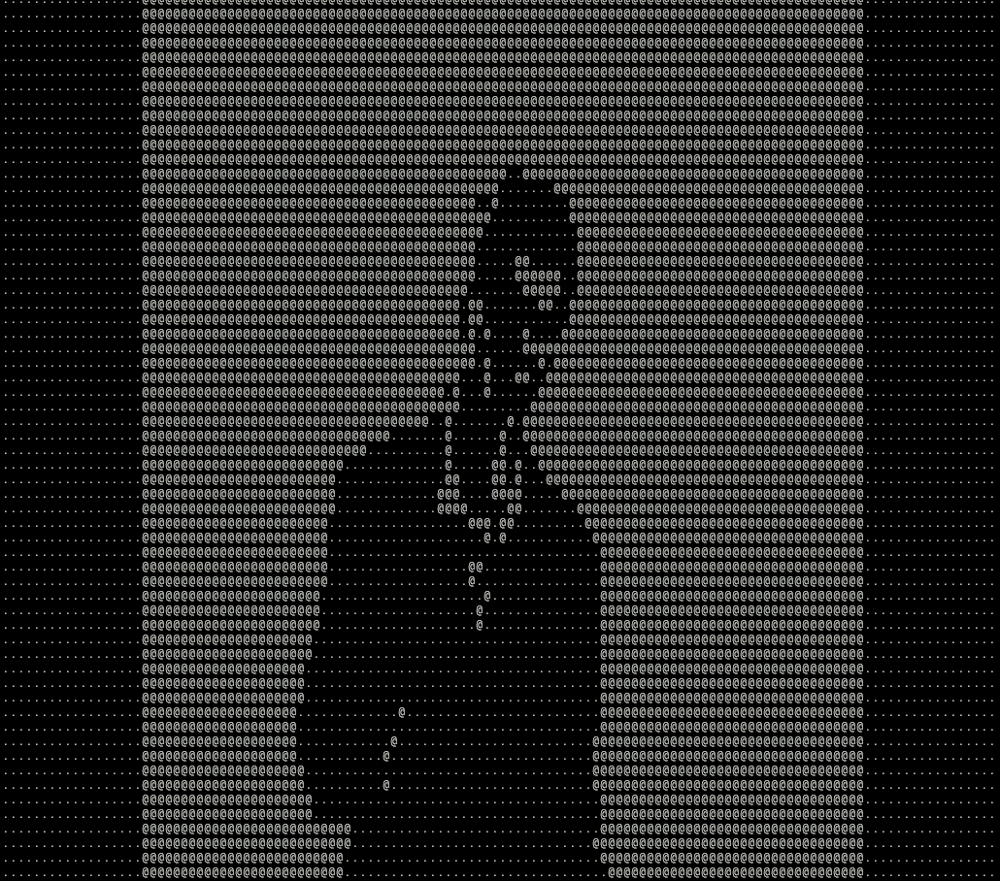

# Aple

<h1>Computer part installation</h1>
<ol style="font-size: 30px">
    <li>Clone "master" branch of this Git repository</li>
    <li>Install dependent libraries: <code>libavcodec</code>, <code>libavformat</code>, <code>libswscale</code></li>
    <li>Compile program using Makefile: <code>make</code></li>
    <li>Run program with specified name of the video: <code>./main input.mp4</code></li>
</ol>
 
 
 
 
 
<h1>/Dev/ Commands</h1>
<h2>Commands in PowerShell:</h2>
<ul style="font-size: 30px">
    <li>List all available devices:   <code>usbipd wsl list</code></li>
    <li>Attach new device by bus id:   <code>usbipd wsl attach --busid {busid}</code></li>
    <li>Deattach certain device by bus id:   <code>usbipd wsl detach --busid {busid}</code></li>
</ul>
<h2>Commands in Linux Terminal (WSL):</h2>
<ul style="font-size:30px">
    <li>List attached USB devices:   <code>lsusb</code></li>
</ul>

<h1>Simply usefull commands</h1>
<ul style="font-size: 30px">
    <li>Set tty ready for work:   <code>stty -F /dev/ttyACM0 raw 115200</code></li>
    <li>Give serial port R/W rights:   <code>chmod g+rw ttyACM0</code></li>
    <li>Establish direct connection to the serial port:   <code>cu -l /dev/ttyACM0 -s 115200</code></li>
    <li>Check current state of the serial port:   <code>ls -l /dev/ttyACM0</code></li>

<h1>Funny gif haha</h1>

  

